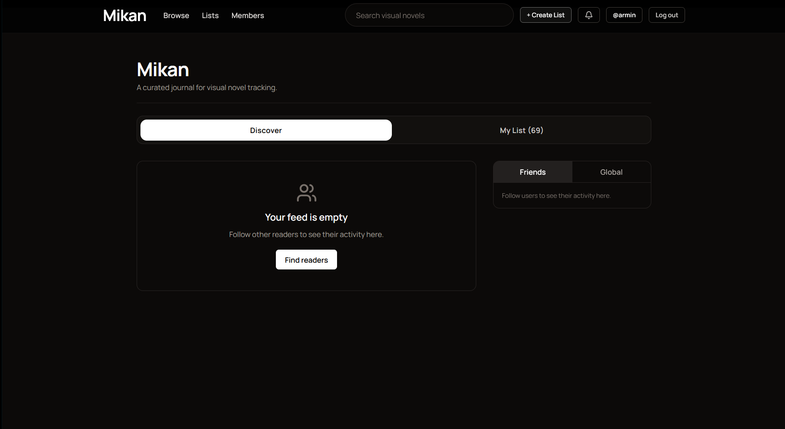
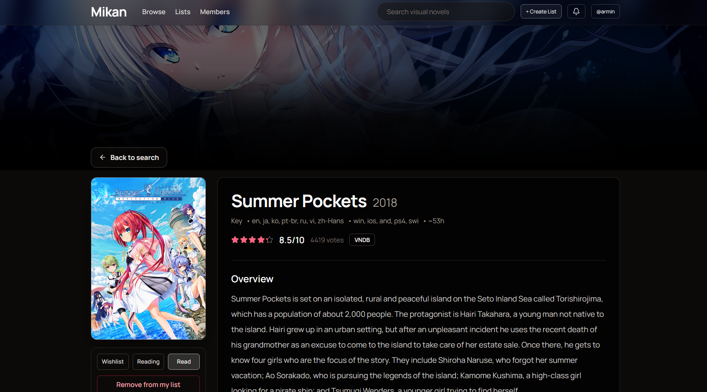
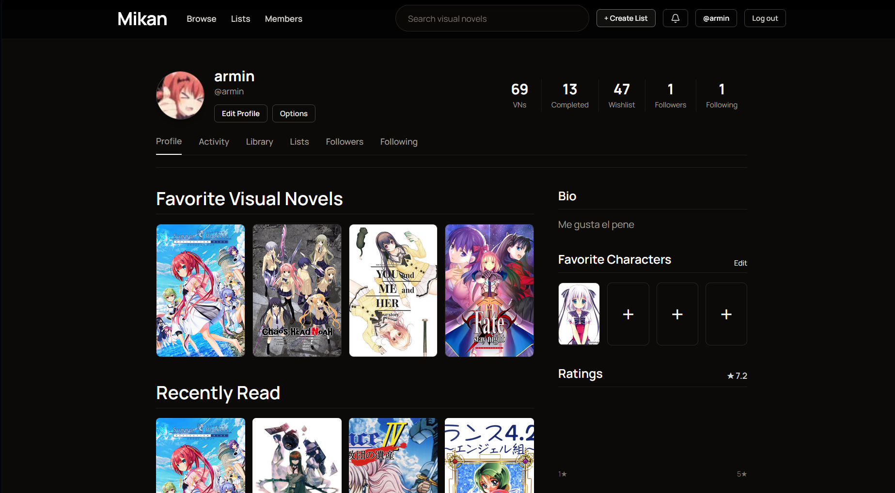
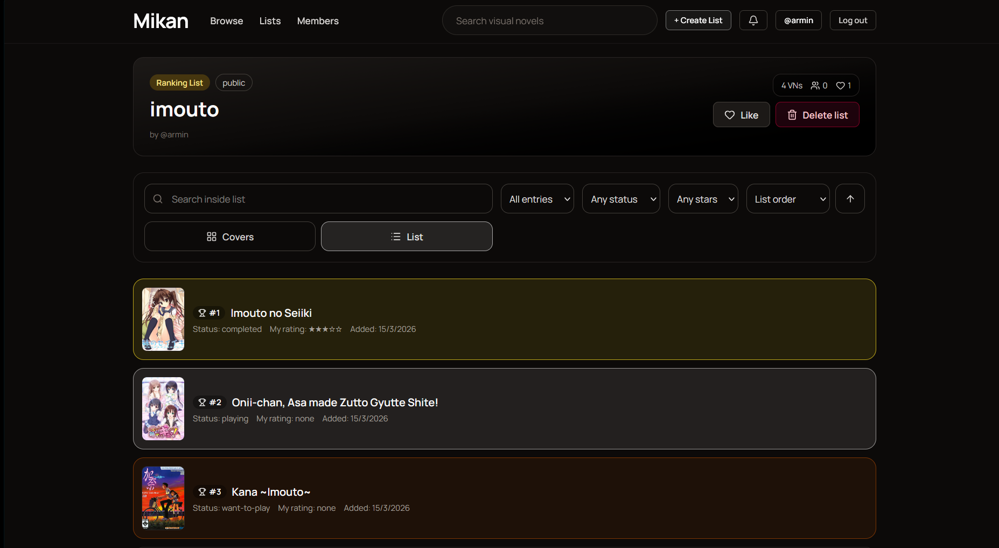
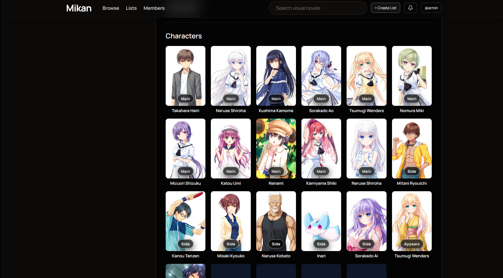
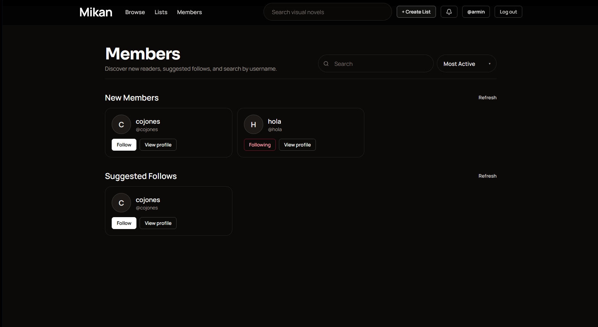

# 🍊 Mikan

A full-stack social tracker for visual novels. Log your reads, write reviews, follow friends, build curated lists, and discover new VNs — all powered by VNDB data.

---

## ✨ Features

### 📚 Personal Tracking
- 📝 Log any VN with status, rating, and review text
- 🗂️ Statuses: `want-to-play` · `playing` · `completed` · `dropped` · `on-hold`
- ⭐ Favorite VNs and characters saved to your profile
- 🖼️ Custom preferred cover per VN
- 📥 VNDB XML import to migrate your existing data
- 🔍 Filter, sort, and search your full log

### 🌐 Social
- 👥 Follow users, see followers/following with privacy controls
- 📰 Friends activity feed + global activity feed
- 🔔 Notifications for follows, status changes, reviews, and recommendations
- 💌 Send direct VN recommendations to friends
- 🏠 Public profile pages with logs, stats, and lists

### 📋 Lists
- ✏️ Create custom lists: `normal` or `ranking` type
- 🔒 Visibility: `public` · `unlisted` · `private`
- 🏷️ Add notes and rank scores per entry, drag to reorder
- ❤️ Like, follow, and comment on other users' lists
- 🌍 Browse public lists with search and sorting

### 🔎 VN Pages
- 📖 Full VN details, releases, and multi-cover gallery
- 💬 Quote feed from VNDB
- 🧑‍🤝‍🧑 Character browsing with detailed character pages
- 📊 Aggregate community stats (public + friends slice)
- ✍️ Community reviews per VN

### ⚙️ Profile & Settings
- 🖼️ Avatar upload and custom display name/bio
- 🔐 Privacy controls
- 🧑 Members directory

---

## 📸 Screenshots

**Home feed**


**VN detail page**


**User profile**


**Custom lists**


**Character details**


**Members directory**


---

## 🛠️ Tech Stack

| Layer | Tech |
|---|---|
| Frontend | React 19, Vite 8, Tailwind CSS 4, React Router 7 |
| Backend | Node.js ESM, Express 5, MongoDB + Mongoose 9 |
| Auth | JWT + bcryptjs |
| Uploads | multer → `backend/uploads/avatars/` |
| External API | [VNDB Kana API](https://api.vndb.org/kana/) |

---

## 🚀 Running Locally

**Requirements:** Node.js 20+, npm, MongoDB URI

```bash
# 1. Install dependencies
cd backend && npm install
cd ../frontend && npm install

# 2. Configure backend — copy and fill in:
cp backend/.env_template backend/.env
#   MONGODB_URI=mongodb+srv://...
#   JWT_SECRET=your-secret

# 3. Start backend (port 3000)
cd backend && npm start

# 4. Start frontend (port 5173)
cd frontend && npm run dev
```

---

## 🌍 Self-Hosting

> The frontend currently uses hardcoded `http://localhost:3000` URLs. For production, replace those with your real API domain before building.

### Option A — Single VPS

1. Install Node.js, Nginx, PM2
2. Set `backend/.env` with production values
3. Update frontend API URLs → your public API domain
4. `cd frontend && npm run build`
5. `cd backend && pm2 start server.js --name mikan-api`
6. Serve `frontend/dist` with Nginx, reverse-proxy `/uploads` → backend
7. Add HTTPS (Let's Encrypt)

### Option B — Split Hosting

| Service | Options |
|---|---|
| Frontend | Vercel, Netlify, Cloudflare Pages |
| Backend | Render, Railway, Fly.io, VPS |
| Database | MongoDB Atlas |

Deploy backend first → update frontend URL → build & deploy frontend → configure CORS.

### ✅ Production checklist
- [ ] Strong `JWT_SECRET`
- [ ] `backend/.env` not in git
- [ ] HTTPS enforced
- [ ] MongoDB network rules + backups
- [ ] Process manager (PM2/systemd)

---

## 📄 License

Code: **GNU AGPL v3.0 or later**

Data note: This project uses [VNDB](https://vndb.org) data (ODbL/DbCL, non-commercial use). You are responsible for complying with [VNDB's terms](https://vndb.org/d17) and any third-party content licensing on your deployment.
